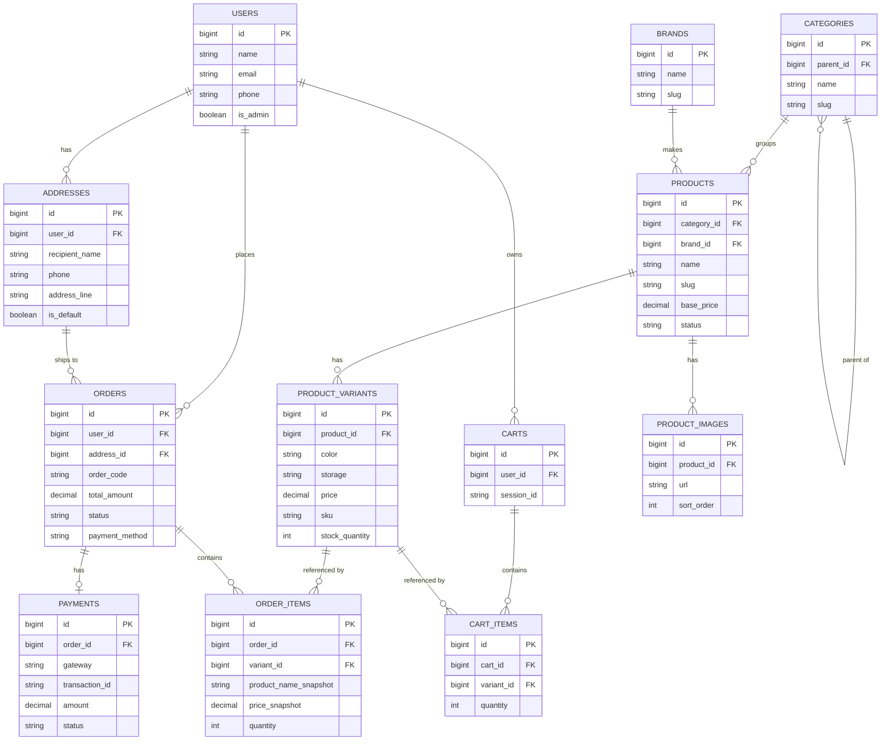

# phuonghihi

Web thương mại điện tử bán điện thoại xây dựng bằng Laravel — catalog sản phẩm, giỏ hàng, checkout, tích hợp thanh toán VNPay (sandbox), và trang quản trị đầy đủ. Dự án luyện tập kỹ năng phát triển web cho vị trí lập trình viên.

## Tính năng chính

**Khách hàng**
- Duyệt catalog theo danh mục/thương hiệu, lọc theo khoảng giá, sắp xếp theo giá/mới nhất
- Trang chi tiết sản phẩm: chọn màu/dung lượng động (Alpine.js), cập nhật giá và tồn kho theo biến thể
- Giỏ hàng hoạt động cho cả khách vãng lai (theo session) lẫn user đăng nhập, tự động gộp khi đăng nhập
- Checkout với địa chỉ giao hàng, thanh toán COD hoặc VNPay
- Theo dõi lịch sử đơn hàng

**Quản trị** (`/admin`, yêu cầu tài khoản `is_admin`)
- CRUD sản phẩm kèm biến thể, ảnh (upload qua Laravel Storage)
- CRUD danh mục, thương hiệu (chặn xoá nếu còn sản phẩm đang tham chiếu)
- Quản lý đơn hàng: lọc theo trạng thái, đổi trạng thái thủ công
- Dashboard: tổng đơn, doanh thu theo ngày/tháng, biểu đồ Chart.js

**Bảo mật / kỹ thuật đáng chú ý**
- Tạo đơn hàng trong `DB::transaction()` với `lockForUpdate()` trên biến thể sản phẩm — chống race condition khi nhiều người mua cùng lúc, kiểm tra lại tồn kho ngay trước khi trừ
- Giá luôn được tính lại phía server từ dữ liệu biến thể trong DB, không bao giờ tin giá client gửi lên
- Xác thực chữ ký HMAC-SHA512 cho cả yêu cầu thanh toán và webhook IPN từ VNPay
- Webhook IPN idempotent — gọi trùng lặp không trừ kho hai lần
- Chặn IDOR: user không thể xem/sửa giỏ hàng hoặc đơn hàng của người khác
- Middleware phân quyền admin riêng biệt

## Stack

- **Backend:** Laravel 13, MySQL
- **Frontend:** Blade, Tailwind CSS, Alpine.js, Chart.js (bundle qua Vite)
- **Auth:** Laravel Breeze
- **Thanh toán:** VNPay (sandbox)
- **Test:** PHPUnit (Feature + Unit)

## Sơ đồ dữ liệu (ERD)



## Cài đặt local

Yêu cầu: PHP 8.3+, Composer, Node.js, MySQL (khuyến nghị dùng [Laragon](https://laragon.org/) trên Windows).

```bash
composer install
npm install
cp .env.example .env
php artisan key:generate
```

Cập nhật `.env`: thông tin kết nối MySQL (`DB_DATABASE`, `DB_USERNAME`, `DB_PASSWORD`).

```bash
php artisan migrate --seed
npm run build
php artisan serve
```

Tài khoản admin mẫu (từ seeder): `admin@phoneshop.test` / `password`.

### Cấu hình VNPay sandbox (tuỳ chọn)

1. Đăng ký tài khoản tại [sandbox.vnpayment.vn](https://sandbox.vnpayment.vn) để lấy `TmnCode` và `HashSecret`.
2. Thêm vào `.env`:
   ```
   VNPAY_TMN_CODE=xxx
   VNPAY_HASH_SECRET=xxx
   ```
3. Dùng `ngrok http 8000` để có URL public, cập nhật IPN URL trên trang quản trị sandbox VNPay trỏ về `https://<ngrok-url>/vnpay/ipn`.

Không có credential thật, luồng COD vẫn hoạt động đầy đủ; luồng VNPay sẽ redirect đúng sang sandbox nhưng bị từ chối do thiếu thông tin merchant.

## Chạy test

```bash
php artisan test
```

47 test (Feature + Unit) bao phủ: transaction tạo đơn hàng & race condition tồn kho, xác thực chữ ký VNPay, idempotency của webhook IPN, phân quyền admin, và chống IDOR (user không thể truy cập dữ liệu của user khác).

## Cấu trúc thư mục đáng chú ý

```
app/Http/Controllers/          Storefront (Cart, Checkout, Product, Order, Vnpay)
app/Http/Controllers/Admin/    Trang quản trị
app/Services/                  CartService, VnpayService
routes/web.php, routes/admin.php
tests/Feature/                 Test tích hợp (checkout, IPN, IDOR, admin)
tests/Unit/                    Test đơn vị (VnpayService)
```
